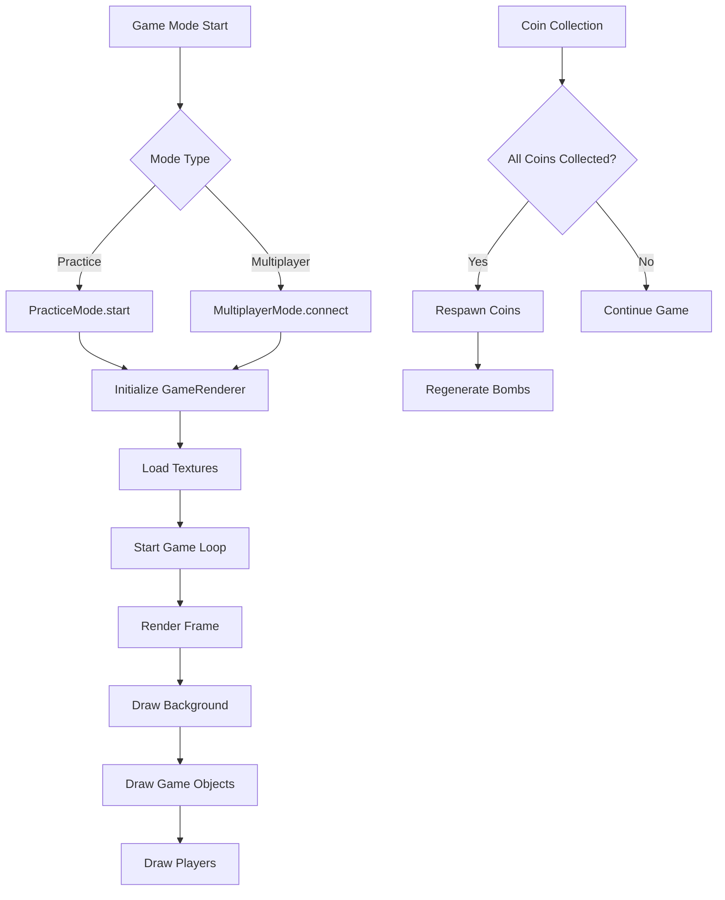

# Design Document: Game Bug Fixes

## Overview

This design addresses three critical bugs in Haunt For Gold that affect gameplay experience:
1. Online multiplayer rendering failures
2. Practice mode displaying gray background instead of spooky theme
3. Coin respawn logic incorrectly coupled with bomb collection

The root causes have been identified through code analysis:
- **Multiplayer rendering**: The `gameRenderer` may not be properly initialized or the game state isn't being passed correctly to the render function
- **Gray background**: The `draw()` function relies on `window.gameRenderer` which may not be initialized when practice mode starts, or texture loading fails silently
- **Coin/bomb coupling**: The `checkCoinRespawn()` function checks if ALL items in the coins array (including bomb-type items) are collected before respawning

## Architecture



## Components and Interfaces

### 1. GameRenderer Initialization Fix

**Problem**: The `window.gameRenderer` may not be initialized before game modes try to use it.

**Solution**: Ensure GameRenderer is created and textures are loaded before any game mode starts rendering.

```javascript
// Ensure renderer exists before rendering
function ensureRendererInitialized() {
  if (!window.gameRenderer) {
    window.gameRenderer = new GameRenderer('gameCanvas');
  }
  return window.gameRenderer;
}
```

### 2. Practice Mode Rendering Fix

**Problem**: Practice mode calls `draw()` which relies on `window.gameRenderer`, but the renderer may not be ready.

**Solution**: 
- Initialize renderer explicitly in `PracticeMode.start()`
- Add fallback rendering if textures aren't loaded
- Ensure the spooky background draws even without grass texture

### 3. Coin Respawn Logic Fix

**Problem**: In practice mode, coins and bombs are stored in the same array with a `type` property. The `checkCoinRespawn()` checks if ALL items are collected, including bombs.

**Current Code (Broken)**:
```javascript
checkCoinRespawn() {
  const uncollectedCoins = this.gameState.coins.filter(
    (coin) => !coin.collected
  );
  if (uncollectedCoins.length === 0) {
    this.generateCoins(); // Only triggers when ALL items collected
  }
}
```

**Solution**: Filter only actual coins (not bombs) when checking for respawn:
```javascript
checkCoinRespawn() {
  const uncollectedCoins = this.gameState.coins.filter(
    (coin) => !coin.collected && coin.type !== 'bomb'
  );
  if (uncollectedCoins.length === 0) {
    this.generateCoins(); // Triggers when all COINS collected
  }
}
```

### 4. Server-Side Coin Respawn Fix

**Problem**: Server checks `playerRoom.coins.every((c) => c.collected)` but coins array doesn't include bombs (they're separate). However, the respawn only happens inside the coin/bomb collection block.

**Solution**: Move the coin respawn check to happen after any movement, not just after collection.

## Data Models

### Game State Structure
```javascript
{
  players: {
    [playerId]: {
      id: string,
      name: string,
      x: number,
      y: number,
      color: string,
      character: string,
      direction: 'left' | 'right',
      mood: 'happy' | 'sad',
      score: number
    }
  },
  coins: [
    { id: number, x: number, y: number, collected: boolean, type?: 'normal' | 'bomb', value?: number }
  ],
  bombs: [
    { id: number, x: number, y: number, exploded: boolean }
  ],
  enemies: [
    { id: number, x: number, y: number, direction: number, moveCounter: number }
  ],
  mapWidth: number,
  mapHeight: number,
  winningScore: number,
  difficultyLevel: number
}
```

## Correctness Properties

*A property is a characteristic or behavior that should hold true across all valid executions of a system-essentially, a formal statement about what the system should do. Properties serve as the bridge between human-readable specifications and machine-verifiable correctness guarantees.*

### Property 1: Coin Respawn Independence from Bombs (Practice Mode)

*For any* practice mode game state where all coins (items with type !== 'bomb') are marked as collected, calling `checkCoinRespawn()` SHALL generate new coins, regardless of whether bomb-type items are collected.

**Validates: Requirements 3.1, 3.2**

### Property 2: Coin Respawn Independence from Bombs (Server)

*For any* multiplayer game room state where all coins are marked as collected, the server SHALL generate new coins, regardless of whether bombs are exploded.

**Validates: Requirements 3.3, 3.4**

### Property 3: Bomb Count Matches Difficulty Level

*For any* difficulty level N > 1, after coins respawn, the number of bombs generated SHALL equal min(5, N - 1).

**Validates: Requirements 3.5**

### Property 4: Game State Round-Trip Serialization

*For any* valid game state object, serializing to JSON and parsing back SHALL produce an equivalent game state object with all properties preserved.

**Validates: Requirements 4.1, 4.2**

## Error Handling

### Texture Loading Failures
- If grass texture fails to load, the renderer SHALL display the gradient background without the texture overlay
- If any texture fails to load, the renderer SHALL use fallback shapes (cursed coins, ghost enemies, pumpkin bombs)
- Texture loading errors SHALL be logged to console but not interrupt gameplay

### Renderer Initialization Failures
- If GameRenderer fails to initialize, the system SHALL fall back to `legacyDraw()` function
- Canvas context errors SHALL be caught and logged

### Socket Connection Issues
- If socket disconnects during game, players SHALL be notified
- Game state SHALL be preserved locally until reconnection or explicit exit

## Testing Strategy

### Unit Tests
- Test `checkCoinRespawn()` with various coin/bomb collection states
- Test `generateCoins()` produces correct number of coins
- Test `generateBombs()` produces correct number based on difficulty

### Property-Based Tests

The property-based testing library for this JavaScript project will be **fast-check**.

Each property test MUST:
- Run a minimum of 100 iterations
- Be tagged with a comment referencing the correctness property
- Use the format: `**Feature: game-bug-fixes, Property {number}: {property_text}**`

#### Test Generators
- `arbitraryGameState()`: Generates random valid game states with varying coin/bomb collection states
- `arbitraryDifficultyLevel()`: Generates difficulty levels 1-10
- `arbitraryCoinArray()`: Generates arrays of coins with random collected states

#### Property Test Cases
1. **Coin Respawn Property**: Generate game states with all coins collected but some bombs uncollected, verify respawn triggers
2. **Bomb Count Property**: Generate difficulty levels, verify bomb count formula
3. **Round-Trip Property**: Generate game states, serialize/parse, verify equality

